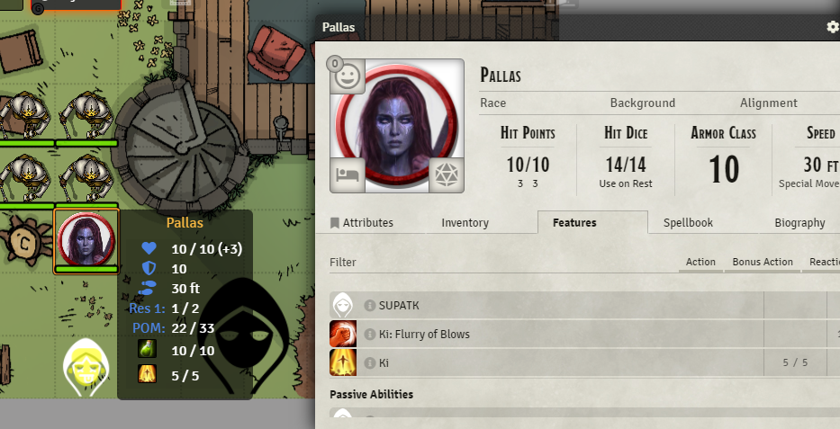
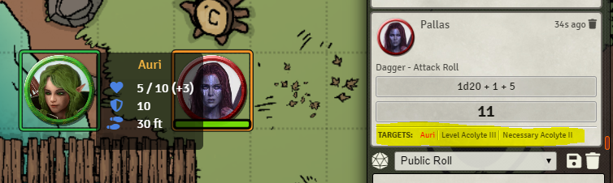
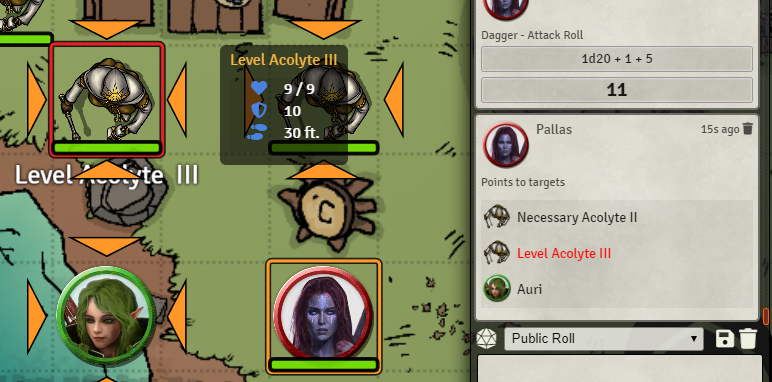
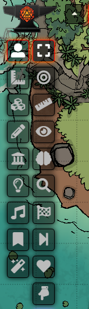
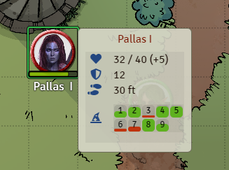

## Cozy Player

* **Author**: Psyny#0677  (Discord)
* **Version**: 1.2.2
* **Foundry VTT Compatibility**: 0.6.2
* **System Compatibility**: D&D 5e
* **Link**: https://github.com/psyny/FoundryVTT/tree/master/CozyPlayer

### Disclaimer

The main purpose of this module was to aid the players of my DnD campaign. The features were directed towards their needs.
However, while discussing about it with other DM's they took interest in the module, so I've decided to made it public.
I don't have plans to do localizations soon.

## Installation
* Open the Foundry application and click **"Install Module"** in the **"Add-On Modules"** tab.
* Paste the following link: https://raw.githubusercontent.com/psyny/FoundryVTT/master/CozyPlayer/cozy-player/module.json
* Click "Install"
* Activate the module in your World using **Manage Modules** under the **Game Settings** tab.

## Features

### General
* Every major feature of this module can be turned on/off.
* Automaticaly close or minimize sheets when making a roll. 
* **Hotkey, hide/show player list:** pressing 'p' will: hide/show player list on the left bottom corner.

### Toolbars
* **Common skills:** invesgation, insight and perception.
* **Combat initiative:** add one or multiple tokens to combat AND roll its initiative. And 
* **Combat pass turn:** pass current turn.
* **Combat HP and temp HP:**  set and add HP and temporarily HP of selected tokens.

### Chat-Token integration, targeting and selection
* **Clickable chat names:** On the chat, some names (like message sender) is hoverable (for tooltips) and clickable (selects its token).
* **Chat targets on roll:** When making a roll, automaticaly attach currented target tokens at the end of the roll info message. If chat integration is turned on, each targeted token token is selectable by other players by clicking on its name.
* **Clear targets:** option to clear targets on making a roll and/or on turn end.
* **Toolbar, targets to chat:** Button to show current targets in chat (see chat integration below). If you are a GM, you have the option picking a random one.
* **Hotkey, switch tools:** pressing 'q' will: switch between 'select' and 'target' tools and clear all targets when switching. 

### Tooltip
* Option to show a tooltip when hovering over a token. It's contents is modular (defined by the GM).
* Tooltip contents, **attributes**: Token name, hit points, armor class, speed.
* Tooltip contents, **skills**: passive perception, passive insight.
* Tooltip content, **actor resources**: Show class resources that have a max value greater than 0.
* Tooltip content, **features**: Show actor features that have charges. Like KI, Superiority Dices, etc.
* Tooltip content, **consumables**: Show actor consumables that have charges. Like potions.
* Tooltip content, **favorites**: When using the tidy5e sheet you can mark some items as favorites. That can be shown on tooltip also.
* Tooltip content, **spell slots**: Show avaliable spell slots.
* **Tooltip icons**: Option to show icons instead of names for identify contents. If no icon is avaliable, the name will be shown anyway (like with class resources). If the name is too long it will be abbreviated. 
* Tooltip other **options**: display based on token permissions, scaleable tooltip size, max number of items on tooltip, max number of items per row, and more.
* Tolltip **style**: Two avaliable styles, black and white.

### Scene interaction
```diff
-DOOR ITERACTION TOOLS REMOVED FROM THIS MODULE.
+I've created a separated module to that: Arms Reach: https://github.com/psyny/FoundryVTT/tree/master/ArmsReach
```

## Known issues
- A lot of language typos.
- Automatic sheet closing (and many features) wont work with betterrolls module.
- For some reason, if you aren't a GM, combat encounter needs to be created (dont need to be started) for initiative roll tool work.

## Other modules I use with this one (can explain some decisions I've made)
* Chat Portrait: https://github.com/ShoyuVanilla/FoundryVTT-Chat-Portrait
* Dice-So-Nice: https://gitlab.com/riccisi/foundryvtt-dice-so-nice
* Easy Target: https://bitbucket.org/Fyorl/easy-target
* Tidy5e Sheet: https://github.com/sdenec/tidy5e-sheet
* Token Mold: https://github.com/Moerill/token-mold
* Turn Marker: https://github.com/Moerill/token-mold

## Screenshots






## Thanks and Credits
- Sky for the amazing token tooltip module that was my starting point for this module (in code, inspiration and knowledge): [link](https://github.com/Sky-Captain-13/foundry/tree/master/token-tooltip) 
- Foundry VTT discord community for always helping me out.

## License
This Foundry VTT module is licensed under a [Creative Commons Attribution 4.0 International License](http://creativecommons.org/licenses/by/4.0/).
This work is licensed under Foundry Virtual Tabletop [EULA - Limited License Agreement for module development v 0.1.6](http://foundryvtt.com/pages/license.html).
